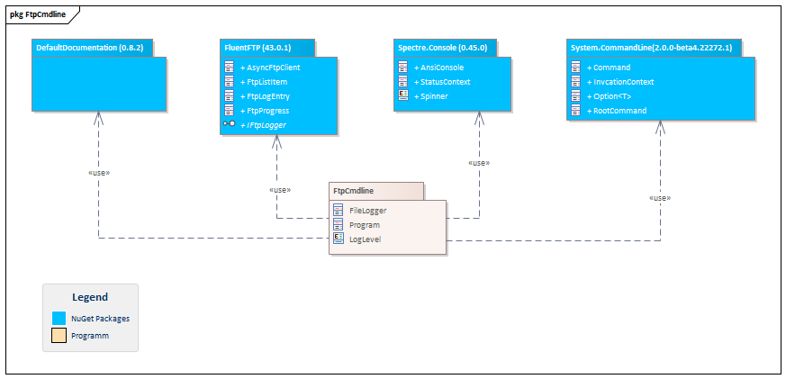
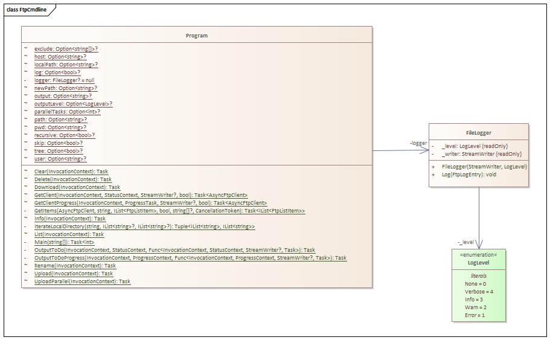
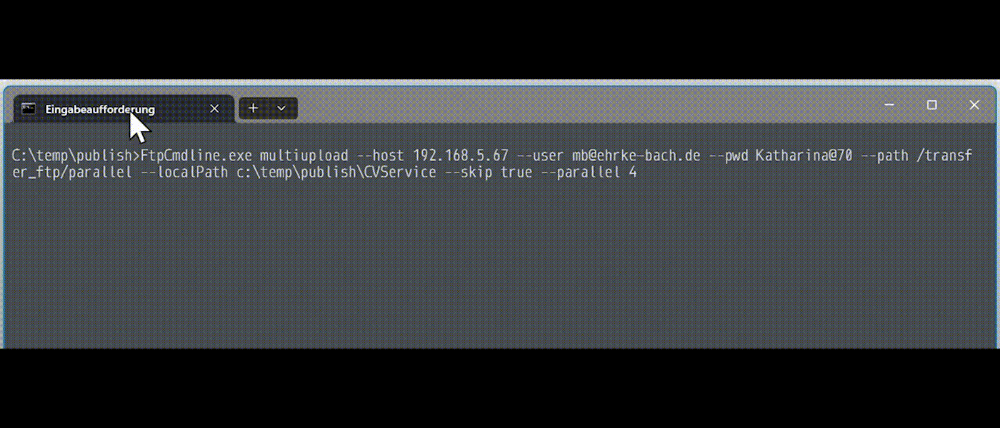
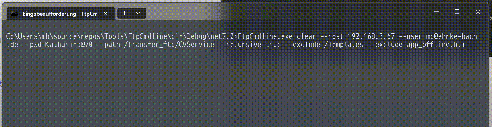

# FtpCmdline

## [FtpCmdline Code Documentation](FtpCmdline/FtpCmdline.md)

### Package Structure



### Class Structure



## Usage 

```Ctrl + C``` to cancel current execution.

The system try to close all resources correctly.

### Command Overview

**FtpCmdline.exe --help**

```
Description:
  FTP Helper

Usage:
  FtpCmdline [command] [options]

Options:
  -h, --host <host> (REQUIRED)                  The FTP host
  -u, --user <user>                             The FTP user
  -p, --pwd <pwd>                               The FTP pwd
  -o, --output <output>                         Result output file []
  --outputLevel <Error|Info|None|Verbose|Warn>  The output file log level [default: None]
  --log                                         Show log output [default: False]
  --version                                     Show version information
  -?, -h, --help

Commands:
  list         List path content on host.
  info         Get Server Infos.
  delete       Delete file or directory on host.
  rename       Rename file or directory on host.
  upload       Upload file or directory to host.
  multiupload  Upload directory to host with multiple parallel streams.
  download     Download file or directory from host.
  clear        Clear items in folder.
```

### Command *list* options

**FtpCmdline.exe list --help**

```
Description:
  List path content on host.

Usage:
  FtpCmdline list [options]

Options:
  --path <path> (REQUIRED)      The path to start []
  -r, --recursive               Go down the directory tree recursivly [default: False]
  -e, --exclude <exclude>       Exclude items in this list
  -t, --tree                    Show only directory tree [default: False]
  -h, --host <host> (REQUIRED)  The FTP host
  -u, --user <user>             The FTP user
  -p, --pwd <pwd>               The FTP pwd
  --log                         Show log output [default: False]
  -?, -h, --help                Show help and usage information
  ```

### Command *list* samples

**FtpCmdline.exe list --host 192.168.5.67 --user mb@ehrke-bach.de --pwd Katharina@70 --path /transfer_ftp**

```
/transfer_ftp/CVService
/transfer_ftp/CVService/app_offline.htm
/transfer_ftp/CVService/IONOSPublish
/transfer_ftp/CVService/IONOSPublish/_app_offline.htm
/transfer_ftp/CVService/Templates
/transfer_ftp/CVService/Templates/ReportTemplate.json
/transfer_ftp/CVService/Templates/Template.docx
Found 7 items
```

**FtpCmdline.exe list --host 192.168.5.67 --user mb@ehrke-bach.de --pwd Katharina@70 --path /transfer_ftp --recursive --tree**

```
CVService
├── IONOSPublish
└── Templates
Found 3 items
```

### Command *info* options

**FtpCmdline.exe info --help**

```
Description:
  Get Server Infos.

Usage:
  FtpCmdline info [options]

Options:
  -h, --host <host> (REQUIRED)  The FTP host
  -u, --user <user>             The FTP user
  -p, --pwd <pwd>               The FTP pwd
  --log                         Show log output [default: False]
  -?, -h, --help                Show help and usage information
```

### Command *info* sample

**FtpCmdline.exe info --host 192.168.5.67 --user mb@ehrke-bach.de --pwd Katharina@70**

```
WindowsServerIIS
Windows
```

### Command *delete* options

**FtpCmdline.exe delete --help**

```
Description:
  Delete file or directory on host.

Usage:
  FtpCmdline delete [options]

Options:
  --path <path> (REQUIRED)      The path to start []
  -h, --host <host> (REQUIRED)  The FTP host
  -u, --user <user>             The FTP user
  -p, --pwd <pwd>               The FTP pwd
  --log                         Show log output [default: False]
  -?, -h, --help                Show help and usage information
```

### Command *delete* samples

**FtpCmdline.exe delete --host 192.168.5.67 --user mb@ehrke-bach.de --pwd Katharina@70 --path /transfer_ftp/willi.jpg**

```
File deleted
```

**FtpCmdline.exe delete --host 192.168.5.67 --user mb@ehrke-bach.de --pwd Katharina@70 --path /transfer_ftp/Willi**

```
File or Directory not exists
```

### Command *rename* options

**FtpCmdline.exe rename --help**

```
Description:
  Rename file or directory on host.

Usage:
  FtpCmdline rename [options]

Options:
  --path <path> (REQUIRED)            The path to start []
  -n, --newPath <newPath> (REQUIRED)  The path renamed to []
  -h, --host <host> (REQUIRED)        The FTP host
  -u, --user <user>                   The FTP user
  -p, --pwd <pwd>                     The FTP pwd
  --log                               Show log output [default: False]
  -?, -h, --help                      Show help and usage information
```

### Command *rename* samples

**FtpCmdline.exe rename --host 192.168.5.67 --user mb@ehrke-bach.de --pwd Katharina@70 --path /transfer_ftp/HALogs --newPath /transfer_ftp/HALogsOld**

```
Directory renamed
```

**FtpCmdline.exe rename --host 192.168.5.67 --user mb@ehrke-bach.de --pwd Katharina@70 --path /transfer_ftp/HALogs --newPath /transfer_ftp/HALogsOld**

```
File or Directory not exists
```

### Command *upload* options

**FtpCmdline.exe upload --help**

```
Description:
  Upload file or directory to host.

Usage:
  FtpCmdline upload [options]

OOptions:
  --path <path> (REQUIRED)      The path to start []
  -l, --localPath <localPath>   The local path to upload []
  -s, --skip                    Skip (true) or overwrite (false) existing files [default: True]
  -h, --host <host> (REQUIRED)  The FTP host
  -u, --user <user>             The FTP user
  -p, --pwd <pwd>               The FTP pwd
  --log                         Show log output [default: False]
  -?, -h, --help                Show help and usage information
```

### Command *upload* sample

**FtpCmdline.exe upload --host 192.168.5.67 --user mb@ehrke-bach.de --pwd Katharina@70 --path /transfer_ftp/willi.jpg --localPath c:\temp\willi.jpg**

```
File uploaded
```


### Command *multiupload* options

**FtpCmdline.exe multiupload --help**

```
Description:
  Upload directory to host with multiple parallel streams.

Usage:
  FtpCmdline multiupload [options]

Options:
  --path <path> (REQUIRED)                      The path to start []
  -l, --localPath <localPath>                   The local path to upload []
  -s, --skip                                    Skip (true) or overwrite (false) existing files [default: True]
  --parallel <parallel>                         The count of parallel upload streams [default: 1]
  -h, --host <host> (REQUIRED)                  The FTP host
  -u, --user <user>                             The FTP user
  -p, --pwd <pwd>                               The FTP pwd
  -o, --output <output>                         Result output file []
  --outputLevel <Error|Info|None|Verbose|Warn>  The output file log level [default: None]
  --log                                         Show log output [default: False]
  -?, -h, --help                                Show help and usage information
```

### Command *multiupload* sample



### Command *download* options

**FtpCmdline.exe download --help**

```
Description:
  Download file or directory from host.

Usage:
  FtpCmdline download [options]

Options:
  --path <path> (REQUIRED)      The path to start []
  -l, --localPath <localPath>   The local path to upload []
  -s, --skip                    Skip (true) or overwrite (false) existing files [default: True]
  -h, --host <host> (REQUIRED)  The FTP host
  -u, --user <user>             The FTP user
  -p, --pwd <pwd>               The FTP pwd
  --log                         Show log output [default: False]
  -?, -h, --help                Show help and usage information
  ```

### Command *download* sample

**FtpCmdline.exe download --host 192.168.5.67 --user mb@ehrke-bach.de --pwd Katharina@70 --localPath c:\temp\HAServer --path /transfer_ftp/HAServer**

```
Directory downloaded
```


### Command *clear* options

**FtpCmdline.exe clear --help**

```
Description:
  Clear items in folder.

Usage:
  FtpCmdline clear [options]

Options:
  --path <path> (REQUIRED)      The path to start []
  -r, --recursive               Go down the directory tree recursivly [default: False]
  -e, --exclude <exclude>       Exclude items in this list
  -h, --host <host> (REQUIRED)  The FTP host
  -u, --user <user>             The FTP user
  -p, --pwd <pwd>               The FTP pwd
  --log                         Show log output [default: False]
  -?, -h, --help                Show help and usage information
```

### Command *clear* sample

**FtpCmdline.exe clear --host 192.168.5.67 --user mb@ehrke-bach.de --pwd Katharina@70 --path /transfer_ftp/CVService --recursive true --exclude /Templates --exclude app_offline.htm**



```
676 files to delete
17 directories to delete
Delete 692 of 693 items
```

**FtpCmdline.exe list --host 192.168.5.67 --user mb@ehrke-bach.de --pwd Katharina@70 --path /transfer_ftp/CVService --recursive true**

```
/transfer_ftp/CVService/app_offline.htm
/transfer_ftp/CVService/IONOSPublish
/transfer_ftp/CVService/IONOSPublish/_app_offline.htm
/transfer_ftp/CVService/Templates
/transfer_ftp/CVService/Templates/ReportTemplate.json
/transfer_ftp/CVService/Templates/Template.docx
Found 6 items
```
