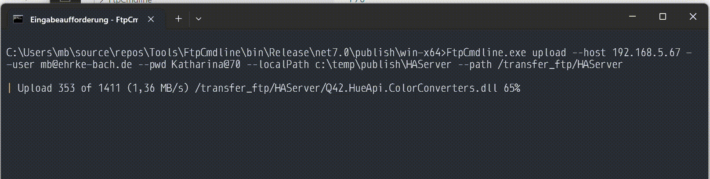
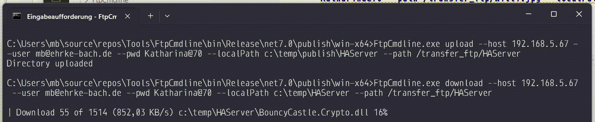

# FtpCmdline

## [FtpCmdline Code Documentation](FtpCmdline/FtpCmdline.md)

## Usage 

```Ctrl + C``` to cancel current execution.

The system try to close all resources correctly.

### Command Overview

**FtpCmdline.exe --help**

```
Description:
  FTP Helper

Usage:
  FtpCmdline [command] [options]

Options:
  -h, --host <host> (REQUIRED)  The FTP host
  -u, --user <user>             The FTP user
  -p, --pwd <pwd>               The FTP pwd
  --log                         Show log output [default: False]
  --version                     Show version information
  -?, -h, --help                Show help and usage information

Commands:
  list      List path content on host.
  info      Get Server Infos.
  delete    Delete file or directory on host.
  rename    Rename file or directory on host.
  upload    Upload file or directory to host.
  download  Download file or directory from host.
```

### Command *list* options

**FtpCmdline.exe list --help**

```
Description:
  List path content on host.

Usage:
  FtpCmdline list [options]

Options:
  --path <path> (REQUIRED)      The path to start []
  -h, --host <host> (REQUIRED)  The FTP host
  -u, --user <user>             The FTP user
  -p, --pwd <pwd>               The FTP pwd
  --log                         Show log output [default: False]
  -?, -h, --help                Show help and usage information
  ```

### Command *list* sample

**FtpCmdline.exe list --host 192.168.5.67 --user mb@ehrke-bach.de --pwd Katharina@70 --path /transfer_ftp**

```
/transfer_ftp/garfield.jpg
/transfer_ftp/halog.log
/transfer_ftp/HALogs
/transfer_ftp/internal-nlog.txt
/transfer_ftp/nlog-all-2023-01-03.log
/transfer_ftp/willi.jpg
```

### Command *info* options

**FtpCmdline.exe info --help**

```
Description:
  Get Server Infos.

Usage:
  FtpCmdline info [options]

Options:
  -h, --host <host> (REQUIRED)  The FTP host
  -u, --user <user>             The FTP user
  -p, --pwd <pwd>               The FTP pwd
  --log                         Show log output [default: False]
  -?, -h, --help                Show help and usage information
```

### Command *info* sample

**FtpCmdline.exe info --host 192.168.5.67 --user mb@ehrke-bach.de --pwd Katharina@70**

```
WindowsServerIIS
Windows
```

### Command *delete* options

**FtpCmdline.exe delete --help**

```
Description:
  Delete file or directory on host.

Usage:
  FtpCmdline delete [options]

Options:
  --path <path> (REQUIRED)      The path to start []
  -h, --host <host> (REQUIRED)  The FTP host
  -u, --user <user>             The FTP user
  -p, --pwd <pwd>               The FTP pwd
  --log                         Show log output [default: False]
  -?, -h, --help                Show help and usage information
```

### Command *delete* samples

**FtpCmdline.exe delete --host 192.168.5.67 --user mb@ehrke-bach.de --pwd Katharina@70 --path /transfer_ftp/willi.jpg**

```
File deleted
```

**FtpCmdline.exe delete --host 192.168.5.67 --user mb@ehrke-bach.de --pwd Katharina@70 --path /transfer_ftp/Willi**

```
File or Directory not exists
```

### Command *rename* options

**FtpCmdline.exe rename --help**

```
Description:
  Rename file or directory on host.

Usage:
  FtpCmdline rename [options]

Options:
  --path <path> (REQUIRED)            The path to start []
  -n, --newPath <newPath> (REQUIRED)  The path renamed to []
  -h, --host <host> (REQUIRED)        The FTP host
  -u, --user <user>                   The FTP user
  -p, --pwd <pwd>                     The FTP pwd
  --log                               Show log output [default: False]
  -?, -h, --help                      Show help and usage information
```

### Command *upload* samples

**FtpCmdline.exe rename --host 192.168.5.67 --user mb@ehrke-bach.de --pwd Katharina@70 --path /transfer_ftp/HALogs --newPath /transfer_ftp/HALogsOld**

```
Directory renamed
```

**FtpCmdline.exe rename --host 192.168.5.67 --user mb@ehrke-bach.de --pwd Katharina@70 --path /transfer_ftp/HALogs --newPath /transfer_ftp/HALogsOld**

```
File or Directory not exists
```

### Command *upload* options

**FtpCmdline.exe upload --help**

```
Description:
  Upload file or directory to host.

Usage:
  FtpCmdline upload [options]

Options:
  --path <path> (REQUIRED)      The path to start []
  -l, --localPath <localPath>   The local path to upload []
  -h, --host <host> (REQUIRED)  The FTP host
  -u, --user <user>             The FTP user
  -p, --pwd <pwd>               The FTP pwd
  --log                         Show log output [default: False]
  -?, -h, --help                Show help and usage information
```

### Command *upload* sample

**FtpCmdline.exe upload --host 192.168.5.67 --user mb@ehrke-bach.de --pwd Katharina@70 --path /transfer_ftp/willi.jpg --localPath c:\temp\willi.jpg**

```
File uploaded
```



### Command *download* options

**FtpCmdline.exe download --help**

```
Description:
  Download file or directory from host.

Usage:
  FtpCmdline download [options]

Options:
  --path <path> (REQUIRED)      The path to start []
  -l, --localPath <localPath>   The local path to upload []
  -h, --host <host> (REQUIRED)  The FTP host
  -u, --user <user>             The FTP user
  -p, --pwd <pwd>               The FTP pwd
  --log                         Show log output [default: False]
  -?, -h, --help                Show help and usage information
  ```

### Command *download* sample

**FtpCmdline.exe download --host 192.168.5.67 --user mb@ehrke-bach.de --pwd Katharina@70 --localPath c:\temp\HAServer --path /transfer_ftp/HAServer**

```
Directory downloaded
```


